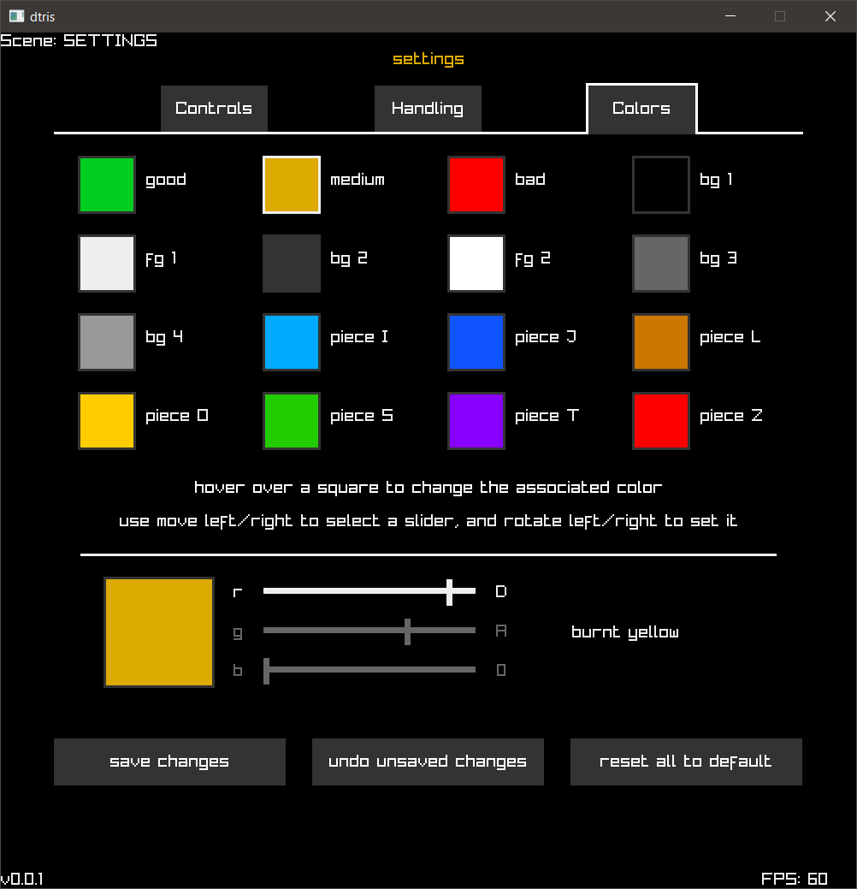

# dtris

tetris in dlang

## features

many nice features:

- extensive customization options:
  - customizable keybinds for piece movement and menu exiting
  - handling: das, arr, sdf
  - color scheme: customizable 12-bit colors for everything drawn to the screen, along with names taken from the xkcd color survey ([see how the color names were mapped](https://github.com/benrosenberg/12bit-color-names))
- typical game features:
  - the SRS rotation system (+ naive 180-spins)
  - ghost pieces
  - next queue
  - hold piece

## screenshots

## todo list

- [ ] keep track of score, game time
- [ ] game over logic
- [ ] leveling
- [ ] finish gamemodes - sprint, blitz
- [ ] decouple piece movement from current 60 fps lock
- [ ] audio
- [ ] support more than one screen resolution
- [ ] display actual key names instead of numeric key codes in keybinds menu

## build details

tested with v2.109.1 of the [DMD compiler for D](https://dlang.org/download.html#dmd) on Windows 10, and v5.5.1 of the [raylib-d](https://code.dlang.org/packages/raylib-d) binding for raylib.
